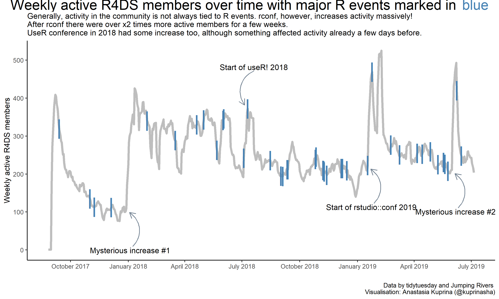

# tidytuesday-R4DS
TidyTuesday on holidays had a dataset from its Slack community. Having been a part of it for a while, I've noticed that new joiners come in waves and often cite conferences that guide them to join the community (same with RLadies).

In an attempt to discover hidden trends, I combined the data provided by [tidytuesday](https://github.com/rfordatascience/tidytuesday/tree/master/data/2019/2019-07-16 "tidytuesday dataset") with data provided by [jumping rivers](https://jumpingrivers.github.io/meetingsR/the-data.html "A list of R conferences & meetings"). 

The outcome:

It's not as pretty as I usually try to make charts, but it's at least informative :)

Original data: 
1: https://github.com/rfordatascience/tidytuesday/tree/master/data/2019/2019-07-16
2: https://jumpingrivers.github.io/meetingsR/the-data.html

Libraries used: 

- tidyverse
- lubridate
- anytime
- magrittr
- grid
- gridExtra
- scales

